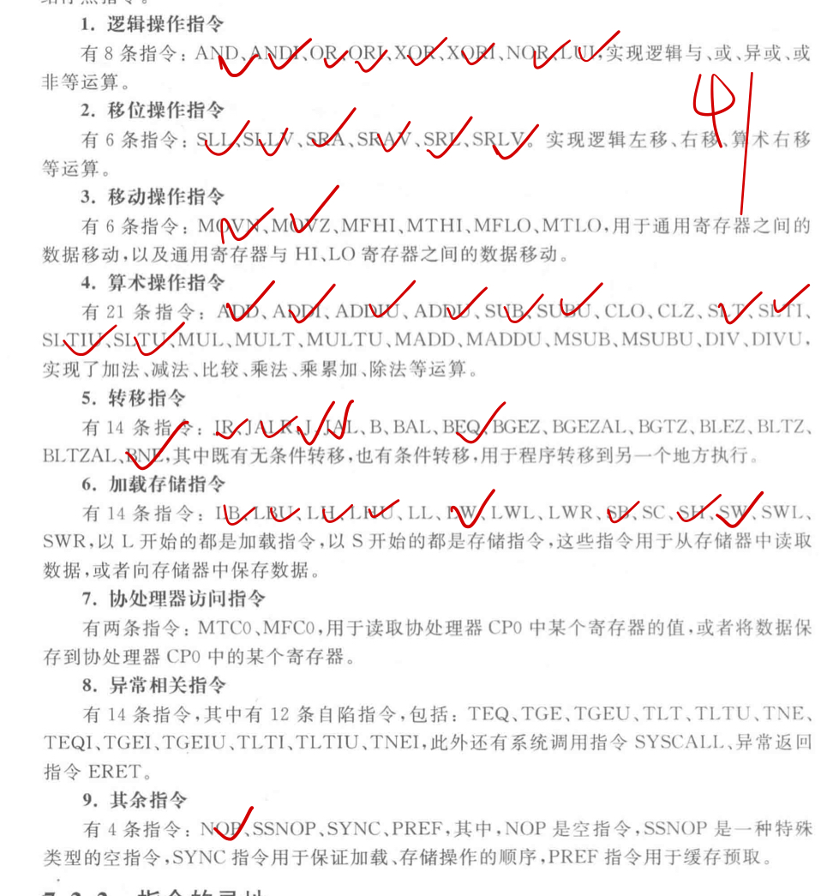
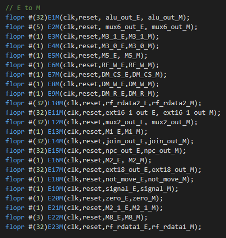

# BIT_miniCPU
北京理工大学大四小学期计算机组成原理部分

### 任务目标

实现流水线CPU，并支持相关指令

- （拓展）实现CP0，cache，分支预测，乱序执行

#### 已经支持的指令

- [ ] 大部分指令可能没有考虑数据冒险的问题（没有进行针对性的测试）。

### 原理图

- [ ] 部分元器件待更新

### 设计思路

由单周期CPU修改而来，单周期的原理图如[下图](#jump)所示

在单周期的设计基础上，添加多个D触发器，组成指令中两阶段的缓冲区，缓冲区具体实现如[下图](#jump2)所示（举例）。

添加D触发器目的就是将上一个指令在不同阶段的时钟信号传递到下一个阶段，保证对应某一个元器件，**它拿到的数据**与**它拿到的控制指令**出自同一条指令的同一个阶段（保证正确性）。

同时还需要加一些向前接的线保证数据前推（**解决数据冒险问题**）。

在明确了各器件的共能够，对于一条新指令的实现基本上可分为：

1. 明确该指令在每个周期内要做什么事情
2. 译码阶段该传递什么样的信号
3. 是否设计特殊的操作？是否需要临时设置标志位来保证信号的传递？
4. 是否需要考虑数据相关等相关性问题？（大部分指令囿于实现难度暂未考虑）

一般来说设计的难点在于有很多种方法可以实现相应的功能，但在开始实现的时候是不知道每种方法的正确性、优劣性的，而且如果没有一个好的顶层设计的话从复用的角度去实现相关指令就非常的难受。比如 JAL 指令，最后要写入$31号寄存器，但是写入寄存器的地址在decode阶段就已经送到了regfile 里，这时候有很多实现的思路：

- 直接写一个特殊的模块（专门写入$31寄存器）来判断
- 从 ALU 往回接一根线来判断
- 跟随写入的数据流动，再写入regfile之前修改，需要传递一个指令是否为JAL的信号
- ...

这里就需要抉择一下，为了保证CPU各部件的功能与结构不受大的影响最后采用了第三种方法。

### 遇到的问题与解决方案

- [ ] Todo